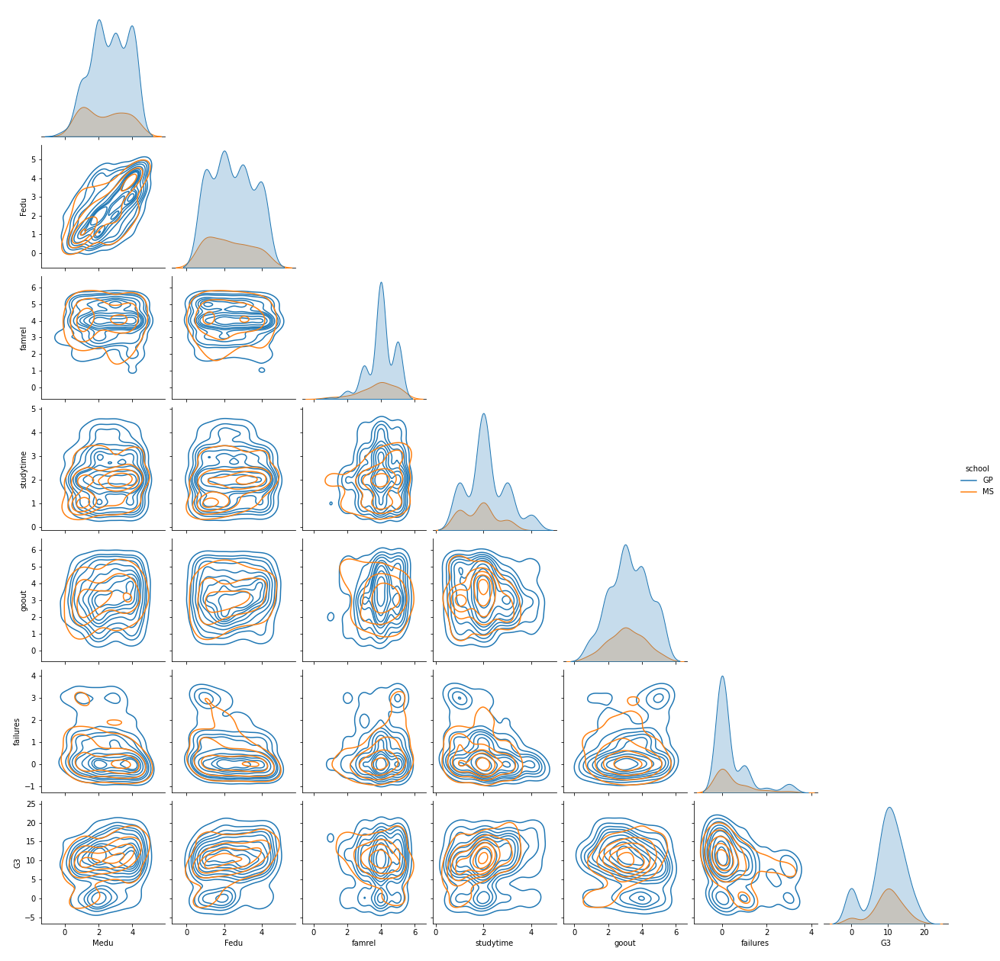

# Using unsupervised learning to denoise portuguese student correlations

This is a short report mainly using MDS to uncover deeper correlations between students, their backgrounds, and their habits by sampling from across 33 attributes from two secondary schools in Portugal. The report explains choice of dataset, noise that had to be removed to allow for inference to occur, and results.

